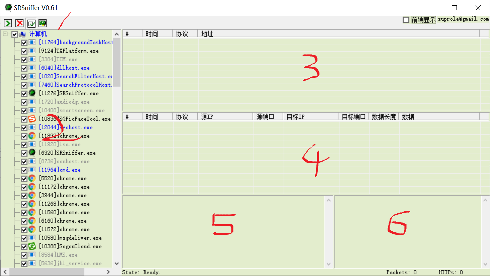
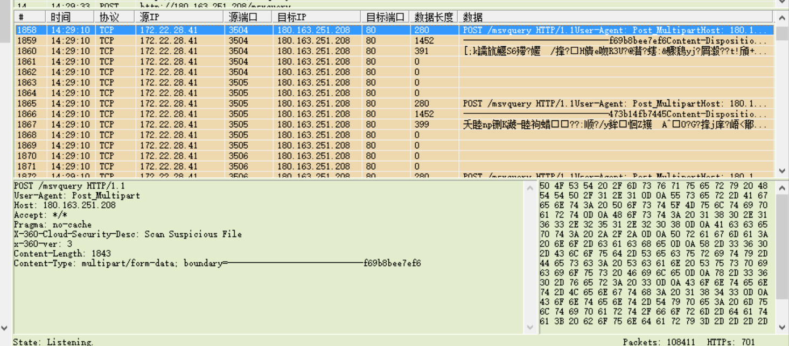

<h1 style="text-align: center">SRSniffer 和 SuperScan 学习报告</h1>
<p style="text-align: center">stormlin 2017-06-04</p>

<!-- TOC -->

- [1. SRSniffer](#1-srsniffer)
    - [1.1 测试过程](#11-测试过程)
    - [1.2 测试结果](#12-测试结果)
- [2. SuperScan](#2-superscan)
    - [2.1](#21)

<!-- /TOC -->

## 1. SRSniffer

网传用户在参加了 360 杀毒的云安全计划之后，它就会在后台上传用户电脑中的“可疑文件（Scan Suspicious File）”。但对于“可疑文件的”的定义，360 官方并没有提供详细的定义。

本次实验通过使用 SRSniffer 来抓取系统中所有包，并分析其中的 360 链接，以确认其是否会在后台上传用户数据，。

### 1.1 测试过程

在互联网上下载 SRSniffer V0.61 绿色版。下载完成后在主机中以管理员用户启动软件。



图一 SRSniffer 的启动界面

软件的界面较为简单，一共分为 6 块。

1.  第一块为工具栏，其上的按钮依次为“开始/停止 监听”、“清除所有数据”、“勾选新进程”和“切换监听网卡”；
2.  第二块为进程列表，可以在这一块勾选需要监听的进程；
3.  第三块为按照时间和目的主机地址排序的会话列表；
4.  第四块为按包排序的详细结果区；
5.  第五块为包内容的文本显示区；
6.  第六块为包内容的十六进制显示区。

### 1.2 测试结果

经过分析，我们发现 360 杀毒的确会向其内部服务器发送一些数据。



图二 360 杀毒向内部服务器发送的数据包

从图中的数据包我们可以发现，接收方服务器的 IP 为：180.163.251.208。但这个服务器已经对接受的数据包进行了过滤：由于抓包结果显示对方端口号为 80，故我们也在浏览器中范围此 IP，但是对方返回“403 Forbidden”。

以下为发送方发出的第一个包。

```java
POST /msvquery HTTP/1.1
User-Agent: Post_Multipart
Host: 180.163.251.208
Accept: */*
Pragma: no-cache
X-360-Cloud-Security-Desc: Scan Suspicious File
x-360-ver: 3
Content-Length: 1843
Content-Type: multipart/form-data; boundary=----------------------------f69b8bee7ef6
```

但由于我们不清楚数据中的格式，也不能确定包中的数据是否为源数据，故无法还原出原始数据。故在此提醒用户，参加云安全计划时要谨慎选择。

## 2. SuperScan

### 2.1 
