<h1 style="text-align: center">The Reading Report for Google Megastore</h1>

stormlin 2017-06-08

**Deadline: Jun. 22**

**ABSTRACTION:**

**Keywords: Megastore, Large database, Paxos, Distributed transaction, Bigtable**

<!-- TOC -->

- [1. Introduction](#1-introduction)
- [2. Availability and Scale](#2-availability-and-scale)
    - [2.1 Replication Algorithms](#21-replication-algorithms)
        - [2.1.1 Traditional Algorithms](#211-traditional-algorithms)
        - [2.1.2 Paxos](#212-paxos)
    - [2.2 Entity Group](#22-entity-group)
    - [2.3 Operations Across Entity Groups](#23-operations-across-entity-groups)
        - [2.3.1 Two-Phase Commit](#231-two-phase-commit)
        - [2.3.2 Asynchronous Message Queue](#232-asynchronous-message-queue)
    - [2.4 Boundary of an Entity Group](#24-boundary-of-an-entity-group)
- [3. Megastore](#3-megastore)
    - [3.1 Assumptions and Philosophy for API Design](#31-assumptions-and-philosophy-for-api-design)
    - [3.2 Data Model with Example](#32-data-model-with-example)
        - [3.2.1 Elimination of Joins](#321-elimination-of-joins)
        - [3.2.2 Indexes](#322-indexes)
    - [3.3 ACID Semantics](#33-acid-semantics)
        - [3.3.1 Write Ahead Log](#331-write-ahead-log)
        - [3.3.2 MultiVersion Concurrency Control](#332-multiversion-concurrency-control)
        - [3.3.2 Reads](#332-reads)
- [4. Replication](#4-replication)
    - [4.1 Origninal Paxos](#41-origninal-paxos)
    - [4.2 Fast Read and Write in Megastore](#42-fast-read-and-write-in-megastore)
        - [4.2.1 Fast Read](#421-fast-read)
        - [4.2.2 Fast Write](#422-fast-write)
    - [4.3 Replica Types](#43-replica-types)
    - [4.4 Architecture](#44-architecture)
    - [4.5 Replicated Logs](#45-replicated-logs)
    - [4.6 Read and Write with Paxos in Megastore](#46-read-and-write-with-paxos-in-megastore)
        - [4.6.1 Reads](#461-reads)
        - [4.6.2 Writes](#462-writes)
    - [4.7 Coordinator Availability](#47-coordinator-availability)
    - [4.8 Tests](#48-tests)
- [5. Conclusion](#5-conclusion)
- [6. Reference](#6-reference)

<!-- /TOC -->

## 1. Introduction

As today`s interactive online services are developing at the speed of light, their natural characteristics had caused huge pressure on traditional cloud computing platform at 3 aspects: development, deployment and administration. But, these seem like conflict requirements.

Take an example. 4 months after the launch event that WeChat is published at 2011, it only takes 4 million users. But the number of active users grows to 800 million at the second quarter this year, what a tremendous growing speed.

From the aspect of service provider, in order to meet the strict requirements that originated from WeChat-like services and their light-speed development, the underlying    cloud computing platform must be *highly scalable* to satify the endless growing users. It also requires *rapid development* to settle the attacks from other familiar services. Furthermore, it clients also demands *low-latency* respond as it is a instant chatting service. Finally, to keep the user-stickness, it also has to guarantee the *availability* for their personal data.

But from the aspect of all three kinds of stakeholders, situations become complicated. Admins wants it to become easy-deployed with high-available policy. Developers wants it can be managed in an automatic way with consistant ACID transactions. And users wants it high-available with good experience naturally.

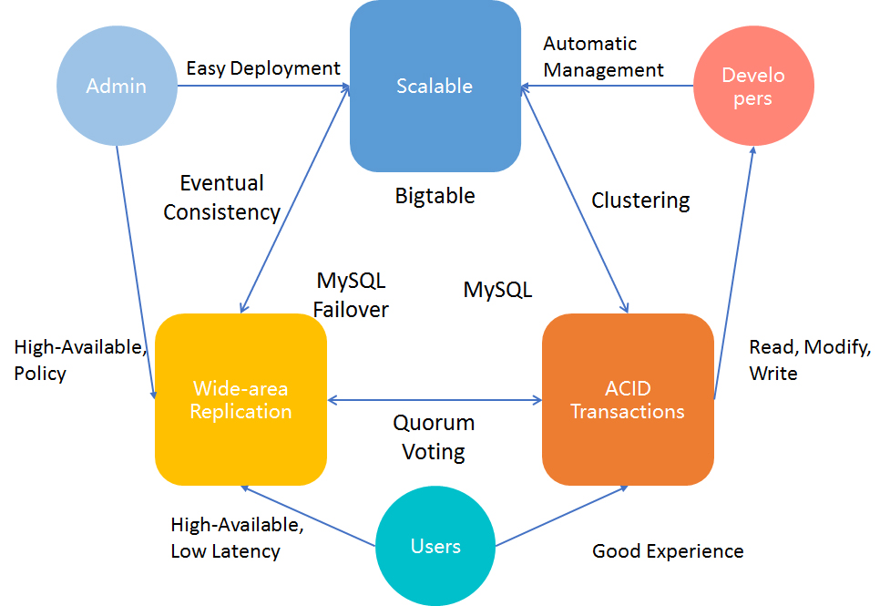

Fig.1 Requirements from all stakeholders

To tackle all this seemingly conflict requirements, we had create tons of new technologies. For example, we use Bigtable to imporve the growing scale, MySQL Failover for wide-area replication and MySQL for ACID tarnsaction.

As far as we know, the more modules a single project has, the more complicated it will be. Therefore, an uniform platform integrating  all the benefits within Bigtable, MySQL and MySQL Failover is necessary for the future development of interactive online services.

## 2. Availability and Scale

Unfortunately, the hardwares are of limited scale and availability. What`s worse, the data is not stored in the same datacenter as before. Therefore, to settle down this problem, we have to focus on system design, so that the whole system can be bound in an proper way with minimum disadvantages.

So far, we had two pratical way to manage it:

1.  **For Availability**
    
    We had inplemented a synchronous, Fault-tolerant log replicator to optimized for long-distance data links(i.e.,  by Chubby).

2.  **For Scale**

    We also introduced NoSQL data storage with its own replicated log(i.e. by Bigtable), to maximize the data scale.

### 2.1 Replication Algorithms

Before we actually step into the door of Megastore, we should have a brief understanding of current replication algorithms, in order to get a better understanding of Megastore`s approach.

#### 2.1.1 Traditional Algorithms

Currently, we had three kinds of traditional algorithms.

1.  **Asynchronous Master/Slave**

    Master maintains the writes ahead log. If there are appends to the replication log, master will be acknowledged in parallel with slave through Message Queue(MQ). But it had a obvious weakness: if the target slave is down, data loss will occur. Therefore an additional consensus protocol is needed.
2.  **Synchronous Master/Slave**

    Master informs its slaves after the changes are applied. But it also has its own weakness: needs a external system to keep the time.

3.  **Optimistic Replication**

    Mutations are propagating through the gourp asynchronous. As the order of propagation is unpredictable, it is impossible to 	implement transaction with such algorithm.

#### 2.1.2 Paxos

In Paxos, there are no distinguished master and slave. It use **vote** and catch up and to keep data consensus. This algorithm is selected by Google, and we will give a thorough explaination with exapmles to clerify the priceiples within it.

### 2.2 Entity Group

To get an complete understanding of Megastore, we have to understand the concept of *Entity Group(EG)*.

An entity group is an abstract concept for a set of related data that stored in Megastore. 

Fig.2 Entity Group

In Fig.2, we assume that there are three datacenters, which show as three vertical cylinders. Also, there are many EGs, but we just place three in this figure to make it simple and clear. All data are stored in a Bigtable within a datacenter.

Getting deep in it, we will see that, there are EG partitions, which store the different parts of data within an EG in some geographical distributed datacenters. Partitions can be the same copy of some instances within an EG, but it also can be part of an instance, which depends on the storage dispatch algorithm in Megastore.

Within an single EG, Megastore provides full ACID semantics, while a looser consistency across EGs, for unpredictable interventions during cross-EG commiting.

### 2.3 Operations Across Entity Groups

Obvious, EGs need to communicate with each other to make a practical program. Up till now, we have two ways to transport data(messages) between EGs: *Two-Phase Commit* and *Message Queue*.

Fig.3 Communication between Entity Groups

This situation is limited within *logically distributed* EG, not *geographical distributed* replicas. The replication algorithm for geographical distributed replicas is much more complicated, we will discuss it in detail later.

#### 2.3.1 Two-Phase Commit

Within an single database, we prefer to use *Two-Phase Commit(2PC)*, to reach data consensus.

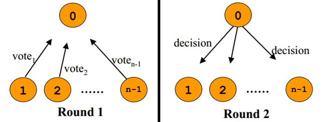

Fig.4 Communicating Procedure

Since 2PC require at least 2 rounds communication for *Voting Phase* and *Commit phase*(Fig.4), it is unacceptable in a geographical distributed environment.

#### 2.3.2 Asynchronous Message Queue

More conveniently, we use *Asynchronous Message Queue* to achieve our goal(See Fig.3).

Communicate with Asynchronous Message Queuer requires less rounds. Sender only simply need to push their messages into the queue, and dispatcher will handle the rest.

### 2.4 Boundary of an Entity Group

To finish the final section for understand the Megastore, we still have to discuss another topic: how to define the boundary of an EG. If we want to make it clear, we have to understand what components can be put together in an EG first. 

Take the email service as an example. Naturally, each email account is an EG: all of his emails and metadata. And emails from different accounts will be regarded as cross-EG transaction.

But when it comes to a map, the situation changes. Forms an EG by country or by continent will be a good choice. But since countries and continents are huge different in size, the size gap between EG will be wide too, which is bad for load balancing between datacenters. Therefore, we will break the map into several patches in the same size.

Fortunately, nearly all applications built on Megastore have found their proper ways to draw entity group boundaries.

## 3. Megastore

To some extent, Megastore is a database system that had overcome traditional disadvantages of RDBMS, as well as provides a set of brand-new features which motivates the fast-development at the same time.

### 3.1 Assumptions and Philosophy for API Design

Before we actually start to design the new service, we have to understand the situation we are facing.

1.  Batched transactions suffer lesser performance lose when using *Store Procedure* than using query command directly.
2.  *Read dominates write*, as most transactions require database read operations.
3.  It is convenient to access the value with provided key in *NoSQL stroage* platform like Bigtable.

Hence, we are able to draw our new design base on these facts(See Fig.5).

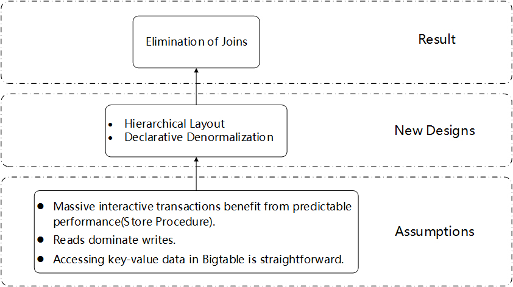

Fig.5 Hierarchical Layout

With *hierarchical layout*, it is easy to construct the Megastore above Bigtable, and use the *declarative denormalization* to help making data storage mapped to Bigtable. Finally, the elimination of joins will be the last result.

### 3.2 Data Model with Example

With a hierarchical philosophy in mind, we had inplemented a layered layout(See Fig.6).

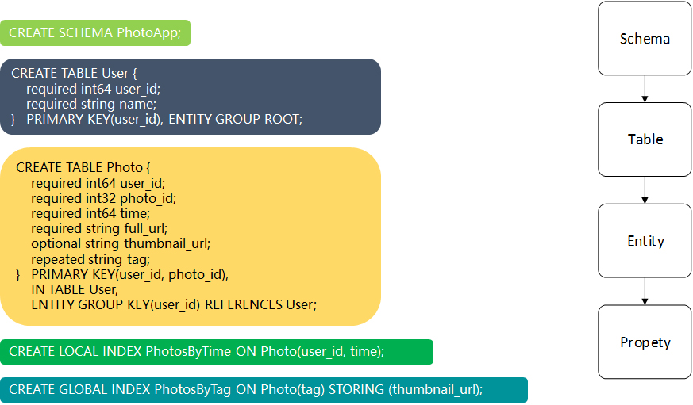

Fig.6 Data Model

Fig.6 is a data model sample which contains a 4-layer layout: *SCHEMA*, *TABLE*, *ENTITY*, *PROPERTY*. In this sample, we created a SCEMA named PhotoApp, a user TABLE under PhotoApp, some Photo table, and 2 indexes.

#### 3.2.1 Elimination of Joins

All tables have their own **Pirmary Keys(PKs)**. In table User, the PK is user_id. In table, the PKs is user_id and photo_id, and user_id refers to the user_id in table User.

Traditionally, it will result in a join operation when a query request demand for information in table Photo. But as we want it become simple and clear, we implement it as Fig.8, some photo instances follow their root user. Therefore, when the query for information in table Photo, Megastore can directly get to target rows with the help of local index. Hence, the existence of joins is eliminated.

#### 3.2.2 Indexes

In Megastore, we provide two types of indexes: global index and local index. Just as their names implies, global index is responsible for the cross-EG query, and the local index is responsible for the local query.

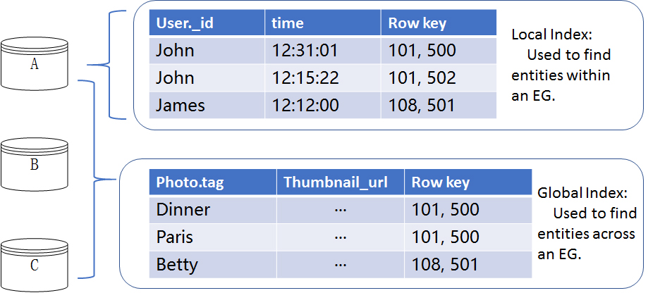

Fig.7 Indexes

Apart from the well-known global index and local index, Megastore also provide additional index features.

1.  Storing Clause

    In global idnex **PhotoByTag**(See Fig.6), we can store a little additional information for the convenience of retrieval. For example, we store the thumbnail_url with the index itself. Therefore, when application server query for the thumbnail_urls, it is unnecessary for Megastore to search in Photo explicitly in table Photo, with rounds of communication saved.

2.  Repeated Indexed

    Each repeated tag has its own index entry(See Fig.7).

3.  Inline Indexes

    Extracting slices of info from child entities and storing it in the parent for fast access.

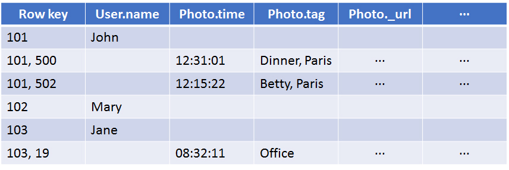

Fig.8 Data in Bigtable

### 3.3 ACID Semantics

It is necessary for a database system to provide fully supported ACID Semanticss. Therefore, Megastore uses **Write Ahead Log(WAL)** and **Multi-Version Concurrency Control(MVCC)** to guarantee the ACID semantics, as well as different types of reads to satify different requirement.

#### 3.3.1 Write Ahead Log

Megastore will write it before apply the changes. It can be used for fail recovery or transaction rollback.

#### 3.3.2 MultiVersion Concurrency Control

MVCC is the key technology to keep the ACID semantics in Megastore. 

In Megastore, Different values can be stored in a single Bigtable cell, with their **timestamps** attached(See Fig.9). And reader uses timestamps to identify the latest value for target property in a fully updated transaction.

|Photo.tag|
|---------|
|[(Dinner, Paris), 12:30:01], [(Father, Mother), 12:31:01]|
|[(Betty, Paris), 12:15:22], [(Betty), 12:16:22]|

Fig.9 MVCC

What`s more, reads and writes are **isolated**, as there are multiply versions. If a writer is appending the latest value to bigtable, reads will fetch the one version older value. But still the latest value until the writer finishes.

#### 3.3.2 Reads

In Megastore, we provide three types of reads to meet the different from different application logics.

1.  **Current Read**

	Always done within a single EG. Read info before confirming all previous transactions are applied.
    
2.  **Snapshot Read**

	Picks up the latest known fully applied version, though there may be some transactions waiting for applied, for example, transactions delayed in Asynchronous Message Queue for network problems.
    
3.  **Inconsistent Read**

	Reads the value in Bigtable directly regards the log status.

Theire differences can be see in Fig.10

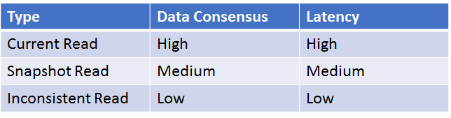

Hence, under MVCC and WHL as well as different reads, the complete lifecycle for a transaction should looked like this:

1.  **Current Read**

	Uses a current read to determine the next available log position.
    
2.  **Application Logic**

	Prepare the data to be written together, and designate it a latest log position. Also, batching writes to a front-end server can reduce the possibility of contention.
    
3.  **Commit**

	Client submit mutations and the server will use Paxos to vote a consensus value across all replicas.
    
4.  **Apply**

	Write mutations that win the Paxos procedure into the Bigtable, with its own timesamp attached.
    
5.  **Clean Up**

	Clean all unnecessary values. For example, older version of a updated value.

## 4. Replication

In this section, we will focus on our implementation of Paxos which is the the heart of our synchronous replica-
tion scheme. After that, we will trun to operational issues and measurement.

### 4.1 Origninal Paxos

A way to reach consensus among a distributed system on a given value by winning more than half votes. There are 2 phases: **Prepare** and **Accept**.

We will take an example to illustrate this. Suppose 25 travellers need to reach a consensus about where to go with 5 additional leaders. All travellers will send their recommendation on where to go to all leaders, with timestamp attached(See Fig.11).

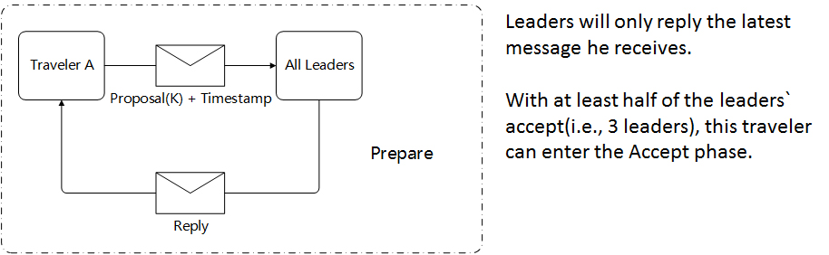

Fig.11 Prepare Phase

There are 2 possible situations if a traceller getting into the Accept Phase(See Fig.12):

1.  **If none of the leaders had made decision. This traveller will send message to all leaders with his proposal.** 
    +   If more half leaders reach a consensus, this will be the decision.
    +   If it is the other situation, he has to retry from Prepare phase.
2.  **At least 1 leader had made decision.**
    +   If more half leaders reach a consensus, this will 
    +   be the decision.
If all leaders had not reached consensus, he will supports the latest decison.

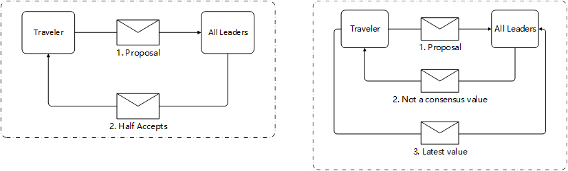

Fig.12 Accept Phase

Apparently, it is ill-suited for possible high letency network as it reqiures multiple rounds of communication.

### 4.2 Fast Read and Write in Megastore

To overcome the disadvantages that make implementing Paxos in Megastore impossible, we introduce two innovative measurements to do it.

#### 4.2.1 Fast Read

As almost all reads are successful in most part of replicas, therefore, allowing local reads with lower latercies and better utilization is reasonable.

Also, to make it simple and safe, we introduce a service named **Coordinator**(See Fig.13). A coordinator is a server tracks a set of entity groups for withc its replica has observed all Paxos writes[2]. In short, coordinator supervise all its slave servers and knows all.

#### 4.2.2 Fast Write

We also implement the **Fast Write** in Megastore with features below:

1.  **Implied prepare message**

	Each successful write implied a prepare message for next log position it needs to perform next write. So, 1 round for each subsequent writes is saved.
    
2.  **Use the closest replica**

	Select the replica with most submitting in this region.

### 4.3 Replica Types

So far, we had implemented three types of replicas in Megastore: **Full Replica**, **Witness Replica**, and **Read-Only Replica**. And there differences will be list as table below.

||Full Replica|Witness Replica|Read-only replica|
|-|-|-|-|
|Current Read|Yes|No|No|
|Log and Data Storage|All|Not-applied log, No data and indexes|Full data snapshot|
|Vote|Yes|Yes|No|
|Usage|All|Tie breakers, Voting|Dissemination - CDN|

### 4.4 Architecture

In Megastore, all key components are locate in three different layers(See Fig.13):

1.  **Application Layer:** Application Server, Megastore Library.
2.  **Megastore Layer:** Replication Server, Coordinator.
3.  **Physical Layer:** Bigtable Server with Logs and Data.

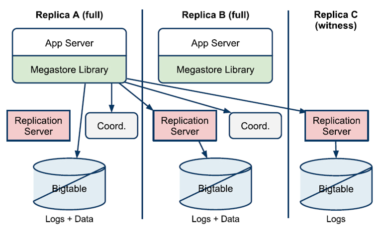

Fig.13 Architecture

### 4.5 Replicated Logs

The funcitoning of Megastore depends on the WHL we discuss in Section 3.3.1. Because there are numerous transaction submitted to Megastore, the status of WHL will be **various**(See Fig.14).

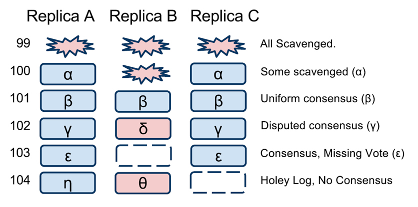

Fig.14 WHL Status

Fig.14 shows 6 different status in different rows:

1.  In Row 99, all log position is out-dated, therfore scavenged to save storage space. 
2.  In row 100, the scavenger is processing with one column cleared.
3.  In row 101, all replicas reach consensus, therfore this log positon should not be scavenged until replace.
4.  In row 102, under the Paxos process, some replicas had not agree on a spectific value proposed by other replicas.
5.  In row 103, there may be problem with Replica B, therefore its voting is mission.
6.  In row 104, probably in the Prepare Phase with different votes from all repolicas with possible latency or disconnection.

### 4.6 Read and Write with Paxos in Megastore

Under the implementation Paxos, we had made modifications on our read and write algorithms to make them a highly available and low-latency service.

#### 4.6.1 Reads

There are 5 steps for read algorithm in Megastore(See Fig.15):
1.  **Query Local**
    Determine if the entity group is up-to-date locally[2].
2.  **Find Position**
	Get the highest log position, and select the corresponding replica.
	1.  Local read. Get the log position and timestamp locally.
	2.  Majority read.
3.  **Catchup**
    1.  Get unknow value from other replica; run Paxos for any unconsensus.
    2.  Apply all consensus value, and push the state up-to-date.
4.  **Validate**
    Send its coordinator a message asserting itself up-to-date.
5.  **Query Data**

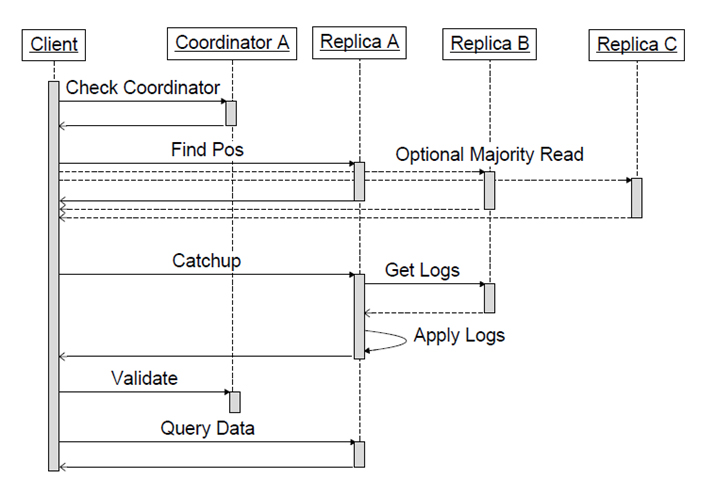

Fig.15 Reads

#### 4.6.2 Writes

There are 5 steps for write algorithm in Megastore(See Fig.16):
1.  **Accept Leader**
    Ask the leader to accept the value as proposal number zero[2].
2.  **Prepare**
	Run Paxos Prepare phase at all replicas[2].
3.  **Accept**
	Ask the rest of replicas to accept the proposal, as the Accept Phase in Paxos. 
4.  **Invalidate**
    If a full replica does`n accept this value, invalidate its coordinator.
5.  **Apply**

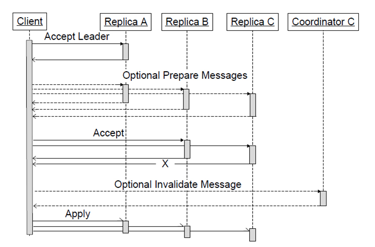

Fig.16 Writes

### 4.7 Coordinator Availability

Coordinator is a simpler process than Bigtable with much more stability. But it still has the risk to crash or other situations that cause its unabaliable. Therefore, reeaders and writers have different strategies against the unstability introduce from coordinator: 

1.  Reader
    To precess a request, a coordinator must hold a majority of its locks[2].
2.  Writer
    Test the coordinator whether it still has locks before a writer submits its transactions.

### 4.8 Tests 

In short, we had made tests on **Availability** and **Latency**.

In our test for availability, we observe an availability for at least 99% at almost all involved hosts in this test(See Fig.17), which proves ths availability on Megastore.

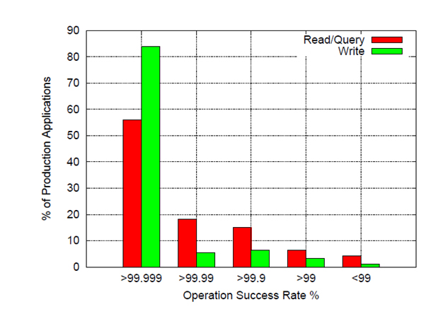

Fig.17 Availability

In our test for latency, we observe an average latency at 100ms for reads and 500ms for writes in more then half host involved in this test(See Fig.17), which proves ths low-latency feature on Megastore.

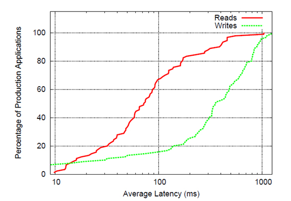

Fig.18 Latency

## 5. Conclusion

In this presentation, we make introduction for the following concepts: Entity Groups, Data Model and MVCC, Paxos in Megastore, Replication algorithm.

Since Megastore is the origin of many distributed systems, we truely hope our audience can fully understand the revolutional concept and theory that Megastore brings to us.

One step further, keep the motivation for learing and innovating is the fundamental motive power towards truth.

## 6. Reference

1.  演员, 微信月活跃用户数量破8亿 ; 2016年腾讯每天收入3亿, https://buluo.qq.com/p/detail.html?bid=261433&pid=7574448-1471501699
2.  Baker J, Bond C, Corbett J, et al. Megastore: Providing Scalable, Highly Available Storage for Interactive Services.[C]// CIDR 2011, Fifth Biennial Conference on Innovative Data Systems Research, Asilomar, CA, USA, January 9-12, 2011, Online Proceedings. DBLP, 2011:223-234.
