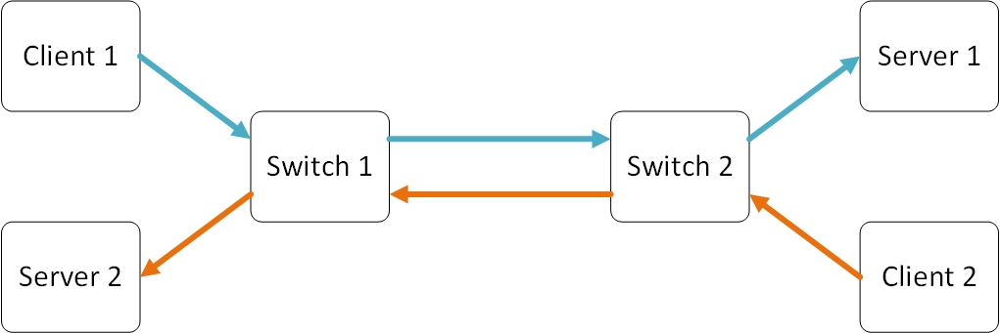
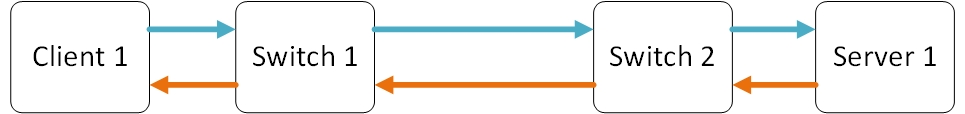
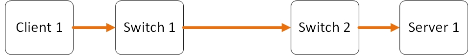

<h1>测试计划</h1>

<!-- TOC -->

- [1.  待测算法](#1--待测算法)
- [2.  性能指标](#2--性能指标)
- [3.  测试网络类型](#3--测试网络类型)
- [4.  实验拓扑](#4--实验拓扑)
- [5.  测试工具](#5--测试工具)
- [6.  测试计划](#6--测试计划)
- [7.  参考文献](#7--参考文献)

<!-- /TOC -->

##  1.  待测算法

1.  测试组：
    +   bbr
    +   bic
    +   cubic
    +   highspeed
    +   htcp
    +   hybla
    +   illinois
    +   scalable
    +   vegas
    +   yeah
2.  对照组：
    +   reno
    +   ctcp

##  2.  性能指标

+   Retransmission Ratio（重传率）：iperf 3 提供了应该发出的总流量，用 iftop 可以获取此 TCP 链接实际发出的总流量，相减即可获得被重传的流量。或者 `iperf 3 -c 192.168.1.1`
+   RTT：由 ping 得出。
+   Thoroughput（总吞吐量）：以 iperf 3 提供的带宽数据为准
+   Fairness（公平性）：以参与测试的各个流量所计算的 Jain`s Fairness Index 为准。见参考文献 5。
+   Efficiency（利用率）：由 iperf 提供的带宽数据与链路的理论数据计算得出。
+   Goodput（实际吞吐量）：由 iperf 提供。
+   Download Time：由 FTP 客户端提供。
+   cwnd：`iperf 3 -c 192.168.1.1`。

##  3.  测试网络类型

+   100M 局域网
+   1G -10G 数据中心内部高速网络
+   1M - 10M 国内互联网
+   亚马逊跨国网络

##  4.  实验拓扑

实验拓扑可以根据实际情况从三种拓扑中挑选一种。

+   2 × 2 双向双通道

    

+   1 × 1 单向双通道

    

+   1 × 1 单向单通道

    

##  5.  测试工具

+   FTP
+   iperf 3
+   Traffic Generator
+   PING
+   Mininet
+   iftop
+   getsockopt
+   tcp_probe
+   ss

##  6.  测试计划

在完成了网络性能基准测试之后，后面的测试可以穿插着进行，以提高实验效率。

1.  网络性能基准测试

    获得指定网络的 Latency，Bandwidth，Retransmission Ratio 以及 BDP。

2.  真实网络测试
    1.  性能指标测试
    2.  FTP 下载时间测试
3.  Mininet 仿真测试
    1.  性能指标测试
        +   在不同延迟下的吞吐率测试
        +   在不同丢包率下的吞吐率测试
        +   在不同带宽下的吞吐率测试
        +   以上组合
    2.  FTP 下载时间测试
    
##  7.  参考文献

1.  Grieco L A, Mascolo S. Performance evaluation and comparison of Westwood+, New Reno, and Vegas TCP congestion control[M]. ACM, 2004.
2.  Lai Y C, Yao C L. TCP congestion control algorithms and a performance comparison[C]// Computer Communications and Networks, 2001. Proceedings. Tenth International Conference on. IEEE, 2001:523-526.
3.  Lukaseder T, Bradatsch L, Erb B, et al. A Comparison of TCP Congestion Control Algorithms in 10G Networks[C]// Local Computer Networks. IEEE, 2016:706-714.
4.  Yeganeh S H, Yeganeh S H, Yeganeh S H, et al. BBR: congestion-based congestion control[J]. Communications of the Acm, 2017, 60(2):58-66.
5.  Jain R, Chiu D, Hawe W. A Quantitative Measure Of Fairness And Discrimination For Resource Allocation In Shared Computer Systems[J]. Computer Science, 1998, cs.ni/9809099.
