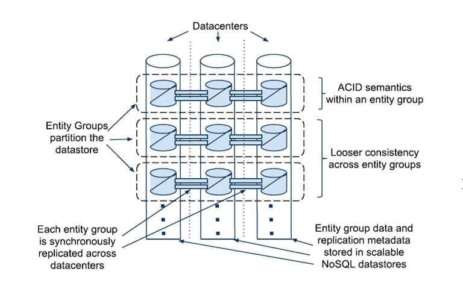
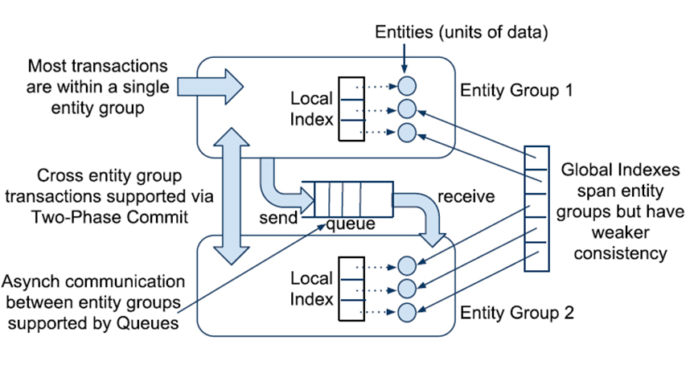

<h1 style="text-align: center">The Reading Report for Google Megastore</h1>

stormlin 2017-06-08

**Deadline: Jun. 22**

**ABSTRACTION:**

**Keywords: Megastore, Large database, Paxos, Distributed transaction, Bigtable**

<!-- TOC -->

- [1. Introduction](#1-introduction)
- [2. Availability and Scale](#2-availability-and-scale)
    - [2.1 Replication Algorithms](#21-replication-algorithms)
        - [2.1.1 Traditional Algorithms](#211-traditional-algorithms)
        - [2.1.2 Paxos](#212-paxos)
    - [2.2 Entity Group](#22-entity-group)
    - [2.3 Operations Across Entity Groups](#23-operations-across-entity-groups)
        - [2.3.1 Two-Phase Commit](#231-two-phase-commit)
        - [2.3.2 Asynchronous Message Queue](#232-asynchronous-message-queue)
    - [2.4 Boundary of an Entity Group](#24-boundary-of-an-entity-group)
- [3. Megastore](#3-megastore)
    - [3.1 Assumptions and Philosophy for API Design](#31-assumptions-and-philosophy-for-api-design)
    - [3.2 Data Model with Example](#32-data-model-with-example)
        - [3.2.1 Elimination of Joins](#321-elimination-of-joins)
        - [3.2.2 Critical Indexes](#322-critical-indexes)
        - [3.2.3 Actual Data Storage with Bigtable](#323-actual-data-storage-with-bigtable)
    - [3.3 ACID Semantics and MVCC within Meagstore](#33-acid-semantics-and-mvcc-within-meagstore)
- [4. Replication](#4-replication)
    - [4.1 Fast Read and Write](#41-fast-read-and-write)
    - [4.2 Replica Types](#42-replica-types)
    - [4.3 Architecture](#43-architecture)
    - [4.4 Replicated Logs](#44-replicated-logs)
    - [4.5 Read and Write with Megastore Paxos](#45-read-and-write-with-megastore-paxos)
    - [4.6 Coordinator Availability](#46-coordinator-availability)
    - [4.7 Tests](#47-tests)
        - [4.7.1 Availability](#471-availability)
        - [4.7.2 Latency](#472-latency)
- [5. Conclusion](#5-conclusion)
- [6. Reference](#6-reference)

<!-- /TOC -->

## 1. Introduction

As today`s interactive online services are developing at the speed of light, their natural characteristics had caused huge pressure on traditional cloud computing platform at 3 aspects: development, deployment and administration. But, these seem like conflict requirements.

Take an example. 4 months after the launch event that WeChat is published at 2011, it only takes 4 million users. But the number of active users grows to 800 million at the second quarter this year, what a tremendous growing speed.

From the aspect of service provider, in order to meet the strict requirements that originated from WeChat-like services and their light-speed development, the underlying    cloud computing platform must be *highly scalable* to satify the endless growing users. It also requires *rapid development* to settle the attacks from other familiar services. Furthermore, it clients also demands *low-latency* respond as it is a instant chatting service. Finally, to keep the user-stickness, it also has to guarantee the *availability* for their personal data.

But from the aspect of all three kinds of stakeholders, situations become complicated. Admins wants it to become easy-deployed with high-available policy. Developers wants it can be managed in an automatic way with consistant ACID transactions. And users wants it high-available with good experience naturally.

Fig.1 Requirements from all stakeholders

To tackle all this seemingly conflict requirements, we had create tons of new technologies. For example, we use Bigtable to imporve the growing scale, MySQL Failover for wide-area replication and MySQL for ACID tarnsaction.

As far as we know, the more modules a single project has, the more complicated it will be. Therefore, an uniform platform integrating  all the benefits within Bigtable, MySQL and MySQL Failover is necessary for the future development of interactive online services.

## 2. Availability and Scale

Unfortunately, the hardwares are of limited scale and availability. What`s worse, the data is not stored in the same datacenter as before. Therefore, to settle down this problem, we have to focus on system design, so that the whole system can be bound in an proper way with minimum disadvantages.

So far, we had two pratical way to manage it:

1.  **For Availability**
    
    We had inplemented a synchronous, Fault-tolerant log replicator to optimized for long-distance data links(i.e.,  by Chubby).

2.  **For Scale**

    We also introduced NoSQL data storage with its own replicated log(i.e. by Bigtable), to maximize the data scale.

### 2.1 Replication Algorithms

Before we actually step into the door of Megastore, we should have a brief understanding of current replication algorithms, in order to get a better understanding of Megastore`s approach.

#### 2.1.1 Traditional Algorithms

Currently, we had three kinds of traditional algorithms.

1.  **Asynchronous Master/Slave**

    Master maintains the writes ahead log. If there are appends to the replication log, master will be acknowledged in parallel with slave through Message Queue(MQ). But it had a obvious weakness: if the target slave is down, data loss will occur. Therefore an additional consensus protocol is needed.
2.  **Synchronous Master/Slave**

    Master informs its slaves after the changes are applied. But it also has its own weakness: needs a external system to keep the time.

3.  **Optimistic Replication**

    Mutations are propagating through the gourp asynchronous. As the order of propagation is unpredictable, it is impossible to 	implement transaction with such algorithm.

#### 2.1.2 Paxos

In Paxos, there are no distinguished master and slave. It use **vote** and catch up and to keep data consensus. This algorithm is selected by Google, and we will give a thorough explaination with exapmles to clerify the priceiples within it.

### 2.2 Entity Group

To get an complete understanding of Megastore, we have to understand the concept of *Entity Group(EG)*.

An entity group is an abstract concept for a set of related data that stored in Megastore. 

Fig.2 Entity Group

In Fig.2, we assume that there are three datacenters, which show as three vertical cylinders. Also, there are many EGs, but we just place three in this figure to make it simple and clear. All data are stored in a Bigtable within a datacenter.

Getting deep in it, we will see that, there are EG partitions, which store the different parts of data within an EG in some geographical distributed datacenters. Partitions can be the same copy of some instances within an EG, but it also can be part of an instance, which depends on the storage dispatch algorithm in Megastore.

Within an single EG, Megastore provides full ACID semantics, while a looser consistency across EGs, for unpredictable interventions during cross-EG commiting.

### 2.3 Operations Across Entity Groups

Obvious, EGs need to communicate with each other to make a practical program. Up till now, we have two ways to transport data(messages) between EGs: *Two-Phase Commit* and *Message Queue*.

Fig.3 Communication between Entity Groups

This situation is limited within *logically distributed* EG, not *geographical distributed* replicas. The replication algorithm for geographical distributed replicas is much more complicated, we will discuss it in detail later.

#### 2.3.1 Two-Phase Commit

Within an single database, we prefer to use *Two-Phase Commit(2PC)*, to reach data consensus.

Fig.4 Communicating Procedure

Since 2PC require at least 2 rounds communication for *Voting Phase* and *Commit phase*(Fig.4), it is unacceptable in a geographical distributed environment.

#### 2.3.2 Asynchronous Message Queue

More conveniently, we use *Asynchronous Message Queue* to achieve our goal(See Fig.3).

Communicate with Asynchronous Message Queuer requires less rounds. Sender only simply need to push their messages into the queue, and dispatcher will handle the rest.

### 2.4 Boundary of an Entity Group

To finish the final section for understand the Megastore, we still have to discuss another topic: how to define the boundary of an EG. If we want to make it clear, we have to understand what components can be put together in an EG first. 

Take the email service as an example. Naturally, each email account is an EG: all of his emails and metadata. And emails from different accounts will be regarded as cross-EG transaction.

But when it comes to a map, the situation changes. Forms an EG by country or by continent will be a good choice. But since countries and continents are huge different in size, the size gap between EG will be wide too, which is bad for load balancing between datacenters. Therefore, we will break the map into several patches in the same size.

Fortunately, nearly all applications built on Megastore have found their proper ways to draw entity group boundaries.

## 3. Megastore

To some extent, Megastore is a database system that had overcome traditional disadvantages of RDBMS, as well as provides a set of brand-new features which motivates the fast-development at the same time.

### 3.1 Assumptions and Philosophy for API Design

Before we actually start to design the new service, we have to understand the situation we are facing.

1.  Batched transactions suffer lesser performance lose when using *Store Procedure* than using query command directly.
2.  *Read dominates write*, as most transactions require database read operations.
3.  It is convenient to access the value with provided key in *NoSQL stroage* platform like Bigtable.

Hence, we are able to draw our new design base on these facts(See Fig.5).

Fig.5 Hierarchical Layout

With *hierarchical layout*, it is easy to construct the Megastore with the support of Bigtable, and use the *declarative denormalization* to help making data storage mapped to Bigtable. Finally, the elimination of joins will be the last result.

### 3.2 Data Model with Example

#### 3.2.1 Elimination of Joins

#### 3.2.2 Critical Indexes

#### 3.2.3 Actual Data Storage with Bigtable

### 3.3 ACID Semantics and MVCC within Meagstore

## 4. Replication

### 4.1 Fast Read and Write

### 4.2 Replica Types

### 4.3 Architecture

### 4.4 Replicated Logs

### 4.5 Read and Write with Megastore Paxos

### 4.6 Coordinator Availability

### 4.7 Tests 

#### 4.7.1 Availability

#### 4.7.2 Latency

## 5. Conclusion

## 6. Reference

1.  演员, 微信月活跃用户数量破8亿 ; 2016年腾讯每天收入3亿, https://buluo.qq.com/p/detail.html?bid=261433&pid=7574448-1471501699
