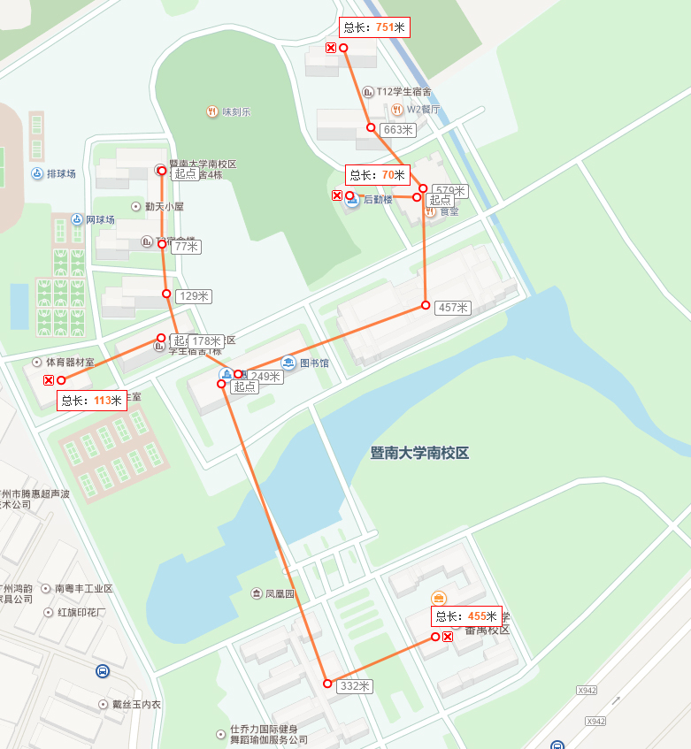

# 组网大作业

**DEADLINE: 2017-06-14**

可用公网 IP 地址块：202.116.0.0/16

A: 10.0.0.0 ~ 10.255.255.255 即 10.0.0.0/8
B: 172.16.0.0 ~ 172.31.255.255即 172.16.0.0/12
C: 192.168.0.0 ~ 192.168.255.255 即 192.168.0.0/16

内部采用 A 类私有地址块：10.0.0.0 - 10.255.255.255（10.0.0.0/8）
 

##  一楼

教室及会议室

3 * 10 = 30 个私有 IP 地址

##  二楼

实验室机房

4 个机房，每个机房 50 台电脑。

有 50 * 3  = 150 台内网主机，50 台公网主机（需要 NAT）

##  三楼

教师办公室

20 * 2 = 40

##  四楼

教师办公室

20 * 2 = 40

##  五楼

服务器机房：DNS 1、WWW 1 和其他 5 台服务器

